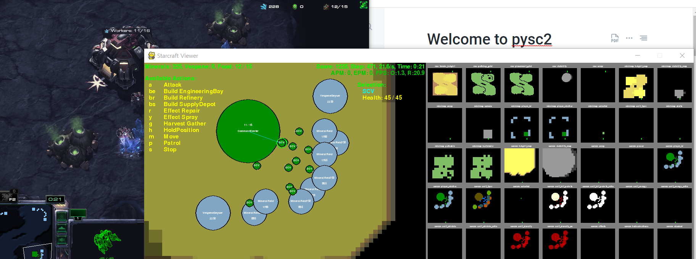

# Welcome to pysc2

## 이 장에서 배울 것  

이 장에서는 아주 기초적인 Pysc2를 다루는 법을 알아볼 것입니다. 모든 도구가 그렇듯, 다루기 위해선 그것을 알아가는 과정이 필요합니다. 알아가는 과정은 항상 낯설지만 인내심을 가지고 흥미를 붙인다면 쉽게 넘어오실 수 있을 것입니다.

Pysc2를 다루기 위해서 두번으로 나누었는데, 이 첫번째 pysc2 handling 장에서 배울 것은 다음과 같습니다.

* 기본적인 환경 세팅 및 환경 동작 원리 이해
* Mini game 을 위한 환경 설정

그러면 시작해 보겠습니다.

## Pysc2 를 통한 기초 환경 세팅

먼저 해야할 것은 pysc2에서 environment를 세팅하는 것입니다.

그러기 위해서 pysc2.env를 import 하겠습니다.

```python
from pysc2.env import sc2_env
```

이를 가지고, 맵, 플레이어세팅\(만들어진 플레이어를 환경에 올려놓는 것이므로 플레이어는 base\_agent를 상속받아 클래스를 넘겨주어야 합니다.\), 인터페이스 크기, 시각화 여부, realtime여, APM 설정등을 할 수 있습니다.

하나하나 만들어 보면,   Map은 tutorial에서 가장 많이 등장하는 Simple64로 하겠습니다.

```python
MAPNAME = 'Simple64'
```

플레이어는 여러분들이 만들 Agent를 넣을 것이고, 하나는 Bot을 넣을 것입니다. 우리는 기본적으로 테란종족을, 봇은 저그를 넣고 아주 쉬운 난이도를 선택하겠습니다.

```python
players = [sc2_env.Agent(sc2_env.Race.terran),\
           sc2_env.Bot(sc2_env.Race.zerg,\
           sc2_env.Difficulty.very_easy)]
```

interface는 map을 몇등분할지, minimap을 몇등분할지 정합니다. int로 넣어주면 정사각형의 interface를 얻을 수 있습니다. 또한 use\_feature\_units를 통해 보이는 unit에 대한 정보를 직접 얻을 수 있습니다.

```python
import pysc2.lib import features 
interface = features.AgentInterfaceFormat(\
                feature_dimensions = features.Dimensions(\
                screen = 64, minimap = 16), use_feature_units = True)
                
```

APM, max episode length를 unlimit을 하기 위한 값 설정과, visualize 설정, realtime 여부를 설정합니다.

```python
APM = 300
APM = int(APM / 18.75)
UNLIMIT = 0
VISUALIZE = True
REALTIME = True
```

이 파라미터들을 가지고, sc2\_env내의 SC2Env를 초기화합니다.

```python
with sc2_env.SC2Env(map_name = MAPNAME, players = players,\
                agent_interface_format = interface,\
                step_mul = APM, game_steps_per_episode = UNLIMIT,\
                visualize = VISUALIZE, realtime = REALTIME) as env:
                pass
```

environment를 열어놓고 환경을 컨트해야하기 때문에 다음처럼 사용합니다.

이제 유저가 Control할 Agent를 만들면,

```python
from pysc2.agents import base_agent
from pysc2.lib import actions

class Agent(base_agent.BaseAgent):
    def step(self,obs):
        super(Agent,self).step(obs)
        return actions.FUNCTIONS.no_op()
agent = Agent()
```

다음과 같습니다. Agent를 만들기 위해 base\_agent를 import하고, Agent가 행동할 수 있는 행동들을 사용하기위해 actions를 import합니다. 이를 통해 만든, 아무 action도 취하지 않는 agent를 만든 것입니다.

Agent는 environment에서 설정된 틱마다 step을 실행하는데, 이때 action들을 담고있는 actions를 불러와 no\_op\(\)을 실행시켜 아무 행동도 안하도록 Agent를 설계합니다.

이제 위에서 만든 것들을 종합하

```python
from pysc2.env import sc2_env
from pysc2.lib import features 
from pysc2.agents import base_agent
from pysc2.lib import actions

MAPNAME = 'Simple64'
APM = 300
APM = int(APM / 18.75)
UNLIMIT = 0
VISUALIZE = True
REALTIME = True

class Agent(base_agent.BaseAgent):
    def step(self,obs):
        super(Agent,self).step(obs)
        return actions.FUNCTIONS.no_op()
        
players = [sc2_env.Agent(sc2_env.Race.terran),\
           sc2_env.Bot(sc2_env.Race.zerg,\
           sc2_env.Difficulty.very_easy)]

interface = features.AgentInterfaceFormat(\
                feature_dimensions = features.Dimensions(\
                screen = 64, minimap = 16), use_feature_units = True)
                
def main(args):
    agent = Agent()
    try:
        with sc2_env.SC2Env(map_name = MAPNAME, players = players,\
                agent_interface_format = interface,\
                step_mul = APM, game_steps_per_episode = UNLIMIT,\
                visualize = VISUALIZE, realtime = REALTIME) as env:
            pass
```

위와 같이 정리할 수 있습니다.이제 agent와 environment를 setup과 reset을 하면 준비가 된 것입니다.

```python
agent.setup(env.observation_spec(), env.action_spec())
timestep = env.reset()
agent.reset()
```

게임동안 while문을 돌며, agent의 step function을 call하면되는데, 이 agent.step\(\)은 step을 통해 얻은 정보들을 담고있고, agent는 environment의 observation을 parameter로 받게됩니다.

```python
while True:
    step_actions = [agent.step(timestep[0])]
    print(timestep[0])
    if timestep[0].last():
        break
    timestep = env.step(step_actions)
```

이제 전체를 한번 구성해보겠습니다.

```python
from pysc2.env import sc2_env
from pysc2.lib import features 
from pysc2.agents import base_agent
from pysc2.lib import actions

from absl import app

MAPNAME = 'Simple64'
APM = 300
APM = int(APM / 18.75)
UNLIMIT = 0
VISUALIZE = True
REALTIME = True

players = [sc2_env.Agent(sc2_env.Race.terran),\
           sc2_env.Bot(sc2_env.Race.zerg,\
           sc2_env.Difficulty.very_easy)]

interface = features.AgentInterfaceFormat(\
                feature_dimensions = features.Dimensions(\
                screen = 64, minimap = 16), use_feature_units = True)

class Agent(base_agent.BaseAgent):
    def step(self,obs):
        super(Agent,self).step(obs)
        return actions.FUNCTIONS.no_op()
    


def main(args):
    agent = Agent()
    try:
        with sc2_env.SC2Env(map_name = MAPNAME, players = players,\
                agent_interface_format = interface,\
                step_mul = APM, game_steps_per_episode = UNLIMIT,\
                visualize = VISUALIZE, realtime = REALTIME) as env:
            agent.setup(env.observation_spec(), env.action_spec())

            timestep = env.reset()
            agent.reset()

            while True:
                step_actions = [agent.step(timestep[0])]
                print(timestep[0])
                if timestep[0].last():
                    break
                timestep = env.step(step_actions)
    except KeyboardInterrupt:
        pass
app.run(main)
```

try except문과 absl을 통한 app실행만 추가되었고 전부 위에서 확인한 내용입니다.



다음과 같이 실행되었다면 정상입니다.


